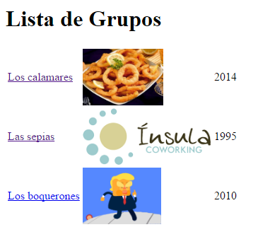
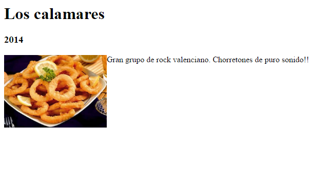
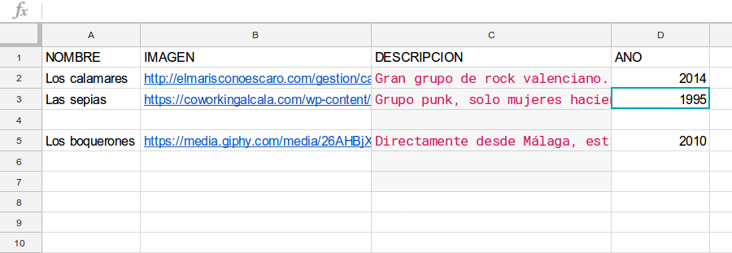

# InsulaSheets - Hackathon
Reto: generar contenidos HTML alimentados por datos en Google Sheets.  
Hemos hecho un ejemplo con un listado de grupos de música y dos vistas web: una de lista de los grupos y otra de detalle de cada grupo al cual se accede a través de la lista anterior.

---

---

---

Herramientas necesarias:
- Google Sheets
- Servidor PHP

Bibliotecas PHP (Composer):
- [Mustache](https://mustache.github.io/) (Plantillas HTML)
- Google Api Client

Pasos:

1. Crear hoja de cáculo de Google o un formulario vinculado a una hoja de cálculo. (necesario estar logeado con una cuenta de Google)

2. Clonamos este repositorio en un servidor (local o en la nube, según nuestra necesidad)
3. Copiamos el id de la hoja

4. Abrimos el archivo `conexion.php` y sustituimos el id anterior en la constante "*DATA_SHEET*"
5. Opcionalmente podemos modificar el rango de las celdas que necesitamos dentro de los archivos `lista.php` y `ficha.php`
6. Ejecutamos por consola: `php lista.php`
7. Nos pedirá dar permisos con una cuenta de google. Copiamos la url que nos muestra y la pegamos en un navegador. Damos permisos a la cuenta de Google con la que creamos la hoja (o alguna con permisos). Ahora copiamos el código devuelto y lo velvemos a pegar en la consola. Esto nos generará una automáticamente un fichero en la carpeta `.credentials`. **Mucho cuidado de no hacer público ese fichero, ya que con él se podrá acceder a tus hojas de cálculo**.
8. Abrimos los ficheros `lista.php` y `ficha.php` y mapeamos los valores de las columnas de la hoja de cáculo, dándoles un nombre que luego usaremos en la plantilla Mustache (mirar comentario).
9. ¡Ahora solo queda poner bonita nuestra plantilla! Para ellos modificamos los ficheros `.mustache` dentro de la carpeta [views](views) según el formato de [Mustache](https://mustache.github.io/). Tenemos en cuenta que los nombres de los campos que acabamos de mapear en los ficheros `.php` tienen que coincidir con los nombres de etiquetas de la plantilla Mustache.

### ¡Y con esto ya tenemos listo nuestro sistema para generar contenidos web a traves de Google Sheets!

Hackathon realizado en la [Ínsula Coworking](www.insulacoworking.es)  
Fecha: 5 de abril de 2017  
Duración: 3 horas  
